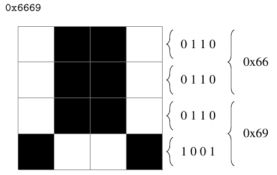

SVZ: a Scalable Visualization Format
====================================

Header
------
SVZ1 <- String
WIDTH <- uint16
HEIGHT <- uint16
OPTIONS <- CHAR 
BLAKE2(data)
NUMBER_OF_FEATURES <- CHAR
Data
----
<FEATURE_ID:0>DISPLAYED_PIXELS <- bitstream
<FEATURE_ID:1>SELECTED_PIXELS <- bitstream
<FEATURE_ID:2>COLOR_FOR_PIXELS <- char (show only the ones selected)
<FEATURE_ID:3>KEY1\0VALUE1\0 <- String
<FEATURE_ID:3>KEY2\0VALUE2\0 <- String

Displaying Pixels
-----------------

